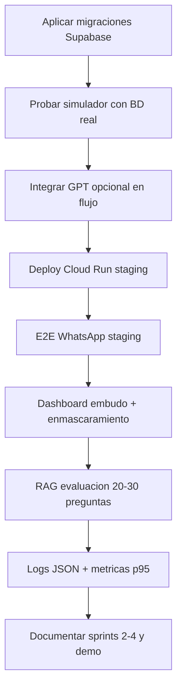

# CrediBot v2 — Resumen de avance y pendientes

**Fecha:** 12 de julio de 2026  
**Fuente:** [plan.md](plan.md), [tareas.md](tareas.md)  
**Propósito:** Reanalizar con Codex lo que falta para cerrar el MVP v2 académico.

---

## 1. Resumen ejecutivo

| Métrica | Valor |
|---|---|
| Avance estimado | **~86%** (~112 / ~130 tareas) |
| Tests automatizados | **47 passing** |
| Commits v2 | **7** (desde `ef87e9c` hasta `60e858c`) |
| Sprints cerrados en código | Sprint 1 y 2 completos; 3 y 4 parciales |
| Bloqueadores externos | Supabase staging, GCP, Meta Business, OpenAI API |

---

## 2. Lo que ya se hizo

### 2.1 Gobierno y datos (EPIC-00, EPIC-01)

- ADR de arquitectura v2: `creditbot/docs/adr/0001-architecture-v2.md`
- Reglas crediticias documentadas: `creditbot/docs/reglas_crediticias_v2.md`
- Migraciones SQL versionadas:
  - `creditbot/supabase/migrations/001_v2_schema.sql`
  - `creditbot/supabase/migrations/002_validation_failures.sql`
- Seed idempotente de **25 perfiles ficticios**: `creditbot/supabase/seed_credit_profiles.sql`
- Guía de migración y rollback: `creditbot/docs/migrations.md`

### 2.2 Dominio crediticio (EPIC-02)

- `creditbot/app/domain/cedula_validator.py` — módulo 10, enmascaramiento
- `creditbot/app/domain/credit_rules.py` — score 1–999, elegibilidad, sistema francés, monto asequible
- Tests: `creditbot/app/tests/test_domain/`

### 2.3 Flujo conversacional v2 sin GPT (EPIC-03)

- Estados v2: consentimiento → cédula → perfil → ingreso → empleo → gastos → plazo → destino → cálculo → confirmación
- `creditbot/app/services/conversation_service.py` reescrito
- `creditbot/app/agent/state_manager.py`
- Mensajes v2 en `message_service.py`
- Fallos de validación persistidos en Supabase (`validation_failures`)
- Tests de flujo: `test_conversation_flow.py`

### 2.4 Tools, GPT y RAG (EPIC-04, EPIC-05, EPIC-06 parcial)

**Tools implementadas:**

| Tool | Archivo |
|---|---|
| `validar_cedula` | `tools/cedula_tools.py` |
| `consultar_perfil_crediticio` | `tools/cedula_tools.py` |
| `verificar_identidad` | `tools/cedula_tools.py` |
| `calcular_monto_maximo` | `tools/credit_tools.py` |
| `registrar_solicitud` | `tools/credit_tools.py` |
| `derivar_a_asesor` | `tools/credit_tools.py` |
| `obtener_politica_credito` | `tools/policy_tools.py` |

- Registry con permisos por estado: `tools/registry.py`
- Auditoría: `repositories/tool_audit_repository.py`
- Orquestador GPT con fallback: `agent/orchestrator.py`
- Proveedor mock para CI: `providers/openai_client.py`
- RAG local por keywords: `rag/retriever.py` + `rag/documents/politicas_credito.md`
- `ENABLE_GPT_AGENT=false` por defecto — el flujo productivo sigue siendo determinista

### 2.5 Integraciones (EPIC-07, EPIC-08, EPIC-09 parcial)

- SessionStore Redis + fallback memoria: `session/session_store.py`
- WhatsApp providers Meta + Twilio: `providers/whatsapp/`
- Idempotencia webhook: `repositories/inbound_events_repository.py`
- Webhook unificado Meta/Twilio: `api/routes_webhook.py`
- Admin protegido con header `X-Admin-Password`: `api/deps.py`, `routes_admin.py`
- Endpoint `/admin/audit/tools`
- Dashboard página auditoría: `dashboard/pages/5_Auditoria.py`
- Doc Meta: `creditbot/docs/meta_whatsapp.md`

### 2.6 DevOps y calidad (EPIC-10, EPIC-11 parcial)

- Dockerfile: `creditbot/infra/Dockerfile`
- CI GitHub Actions: `.github/workflows/ci.yml` (ruff + pytest + docker build)
- Plantilla Cloud Run: `creditbot/infra/cloudrun.yaml`
- Runbook: `creditbot/docs/runbook.md`
- Diagrama estados: `creditbot/docs/diagramas/flujo_estados.mmd`
- Sprint 1 documentado: `creditbot/docs/sprints/sprint-1.md`
- README v2 con declaración de IA
- E2E simulador: `app/tests/test_e2e_simulator.py`
- `.env.example` ampliado con OpenAI, Meta, Redis

### 2.7 Commits realizados

```
ef87e9c feat(datos): migraciones v2, seed y ADR de arquitectura
a93d38d feat(dominio): reglas crediticias v2 y validador de cedula
9fd4fd5 feat(flujo): conversacion v2 determinista con cedula y reglas
1007b4d feat(agente): tools auditables, RAG y orquestador GPT
899b75c feat(integraciones): Meta WhatsApp, Redis sesion e idempotencia
bccebb7 feat(devops): Docker, CI GitHub Actions y documentacion v2
60e858c test(e2e): flujo simulador v2 y doc Meta WhatsApp
```

### 2.8 Estructura nueva del backend

```text
creditbot/app/
├── agent/          # orchestrator, prompts, state_manager
├── domain/         # credit_rules, cedula_validator
├── tools/          # registry + 7 tools
├── rag/            # retriever + documents/
├── providers/      # openai_client, whatsapp/
├── session/        # session_store (Redis/fallback)
└── tests/
    ├── test_domain/
    ├── test_tools/
    ├── test_agent/
    ├── test_rag/
    └── test_e2e_simulator.py
```

---

## 3. Lo que falta (para Codex)

### 3.1 Crítico — bloquea demo en vivo (P0)

| ID | Tarea | Detalle | Dependencia |
|---|---|---|---|
| **OPS-05** | Auth GitHub → GCP | Workload Identity o service account para deploy | Cuenta GCP del equipo |
| **OPS-06** | Deploy staging Cloud Run | Workflow `deploy.yml` + Artifact Registry | OPS-05 |
| **OPS-07** | Deploy demo con aprobación | Entorno demo separado de staging | OPS-06 |
| **—** | Aplicar migraciones en Supabase | Ejecutar `schema.sql` + `001` + `002` + seed en proyecto real | Proyecto Supabase staging |
| **QA-05** | E2E WhatsApp staging | Conversación real Meta o Twilio de punta a punta | Meta/Twilio + deploy |
| **QA-12** | Guion y datos de demo | 5 perfiles de respaldo ensayados | Seed aplicado |
| **QA-13** | Ensayo general | Demo 10–15 min sin fallos | Todo lo anterior |

### 3.2 Importante — cierre académico (P0/P1)

| ID | Tarea | Detalle |
|---|---|---|
| **GOV-02** | Asignar roles | PO, SM, Backend, AI/RAG, Cloud, Dashboard/QA con nombres reales |
| **GOV-03** | GitHub Project | Cargar backlog de `tareas.md` / `plan.md` |
| **GOV-06** | Convenciones de commits | Documentar formato (ya se usa español corto) |
| **GOV-07** | Fijar versiones | Pin `requirements.txt` con hashes o `pip-tools` |
| **GOV-04** | Docs v1 desactualizados | Actualizar `flujo_conversacional.md`, `endpoints.md`, `despliegue.md` |
| **DATA-12** | RLS y service role | Políticas Supabase; service role solo en backend |
| **RAG-07** | 20–30 preguntas evaluación | Archivo `docs/rag/evaluacion.md` con respuestas esperadas |
| **RAG-08** | Métricas recuperación | Script que mida hit rate del retriever |
| **SES-06** | Continuar si Redis falla | Fallback explícito a Supabase (hoy solo memoria) |
| **SES-07** | Pruebas concurrencia | Dos usuarios simultáneos sin mezcla de estado |
| **WA-08** | Procesamiento desacoplado | Cola o background task si latencia GPT sube |
| **WA-09** | Plantillas Meta transaccionales | Templates para confirmación de precalificación |
| **WA-10** | Tests payloads Meta | Errores, reintentos, firma inválida |
| **ADM-07** | Embudo en dashboard | Conversaciones por estado, handoff |
| **ADM-08** | Enmascarar cédula en Streamlit | Hoy solo en API admin |
| **ADM-09** | Cierre de casos handoff | Botón cerrar caso en dashboard |
| **ADM-10** | Tests autorización dashboard | Probar login y filtros |
| **OPS-08** | GCP Secret Manager | Secretos fuera de `.env` en producción |
| **OPS-09** | Logs JSON | `correlation_id`, latencia, enmascaramiento |
| **OPS-10** | Correlation ID | Propagar ID en webhook → tools → respuesta |
| **OPS-11** | Métricas p95, tokens, costo | Medición real en staging |
| **OPS-12** | Alertas mínimas | Cloud Monitoring o similar |
| **QA-02** | Cobertura dominio/tools/estados | Ampliar casos límite del plan §11 |
| **QA-03** | Integración Supabase prueba | Tests contra proyecto de test real (no solo mocks) |
| **QA-06** | Duplicados, reinicios, caídas | Redis caído, Supabase timeout, OpenAI timeout |
| **QA-07** | p95 < 8 segundos | Benchmark con httpx/locust |
| **QA-09** | Sprints 2, 3 y 4 documentados | `docs/sprints/sprint-{2,3,4}.md` + retrospectivas |

### 3.3 Mejoras técnicas — no bloquean MVP pero plan las pide

| Área | Estado actual | Falta |
|---|---|---|
| **GPT en producción** | Orquestador existe, desactivado | Integrar `AgentOrchestrator` en `conversation_service` cuando `ENABLE_GPT_AGENT=true` |
| **RAG pgvector** | Tablas en migración; retriever usa keywords | `rag/ingest.py`, embeddings OpenAI, búsqueda vectorial en Supabase |
| **LangChain** | Plan permite omitir | Confirmado: seguir sin LangChain |
| **credit_service.py v1** | Sigue en repo, no usado por flujo v2 | Deprecar o redirigir a `domain/credit_rules.py` |
| **Panel Streamlit deploy** | Solo local | Desplegar en Render/Cloud Run como servicio aparte |
| **Diagramas C4** | Solo flujo de estados | `docs/diagramas/contexto.mmd`, `contenedores.mmd`, `dominio.mmd` |
| **Story mapping** | Parcial en README raíz | Actualizar con flujo v2 |
| **RAG-09 cache** | No implementado | P2 — cache de consultas frecuentes |
| **GOV-08** | Tests v1 + v2 pasan (47) | Marcar hecho en `tareas.md`; añadir badge CI en README |

---

## 4. Criterios de aceptación del plan — estado

### Funcionales

| Criterio | Estado |
|---|---|
| Inicio por Meta o simulador | Parcial — simulador OK; Meta sin probar en staging |
| Aviso y consentimiento | Hecho |
| Validación módulo 10 | Hecho |
| Perfil y score desde Supabase | Código listo; falta aplicar seed en BD real |
| Elegibilidad sin GPT | Hecho |
| Monto y cuota desde tools | Hecho |
| GPT no inventa datos | Guardrails en orquestador; GPT no integrado al flujo principal |
| RAG responde con evidencia | Parcial — keywords, no pgvector |
| Asesor disponible siempre | Hecho |
| Duplicados descartados | Código listo; falta probar en staging |
| Sesiones aisladas | Parcial — falta prueba concurrencia |
| Persistencia y auditoría | Código listo |
| Dashboard protegido | Parcial — API sí; Streamlit básico |

### No funcionales

| Criterio | Estado |
|---|---|
| p95 < 8 s | No medido |
| Secretos fuera del repo | Hecho en código |
| Datos enmascarados | Parcial — API admin sí; logs y dashboard incompletos |
| Fallback OpenAI | Hecho (mock + determinista) |
| Recuperación Redis | Parcial — fallback memoria, no Supabase |
| Docker reproducible | Hecho |
| CI funcional | Hecho (falta push a GitHub para verificar) |
| Cloud Run accesible | No desplegado |
| Rollback probado | Documentado, no ejecutado |

### Académicos

| Criterio | Estado |
|---|---|
| Backlog priorizado | Hecho (`tareas.md`, `plan.md`) |
| Cuatro sprints documentados | 1/4 (solo sprint-1.md) |
| Planning, review, retrospectiva | Pendiente |
| Story mapping actualizado | Pendiente |
| Diagramas Mermaid | 1/4 (solo flujo estados) |
| Declaración de uso de IA | Hecho en README |
| README y guía | Parcial — README v2; guías v1 desactualizadas |
| Demo ensayada | Pendiente |
| Retrospectiva final | Pendiente |

---

## 5. Orden sugerido para Codex



### Prioridad 1 (esta semana)

1. Aplicar migraciones + seed en Supabase staging
2. Probar flujo completo con `/simulate/message` contra BD real
3. Crear `deploy.yml` y desplegar Cloud Run
4. E2E WhatsApp con Twilio (más rápido que Meta)

### Prioridad 2 (siguiente semana)

5. Integrar GPT al flujo con `ENABLE_GPT_AGENT=true`
6. RAG con pgvector + ingest de documentos
7. Dashboard embudo y cierre de handoff
8. Sprints 2–4 + retrospectivas + guion demo

### Prioridad 3 (pulido)

9. Métricas, alertas, correlation_id
10. Diagramas C4, story mapping
11. GitHub Project y roles del equipo
12. Meta plantillas transaccionales

---

## 6. Comandos útiles para retomar

```bash
# Tests
cd creditbot
pytest app/tests -q

# Servidor local
uvicorn app.main:app --reload

# Simulador
curl -X POST http://localhost:8000/simulate/message \
  -H "Content-Type: application/json" \
  -d '{"phone":"593999999999","message":"Hola"}'

# Docker
docker build -f infra/Dockerfile -t credibot:local .

# Dashboard
streamlit run dashboard/app.py
```

### Cédulas de prueba (seed)

| Perfil | Cédula | Score | Resultado esperado |
|---|---|---|---|
| Excelente | `1713175071` | 820 | preaprobado |
| Aceptable | `0923456719` | 650 | preaprobado/observado |
| Regular | `0969012376` | 420 | observado |
| Alto riesgo | `1303456717` | 280 | no_cumple |
| Con mora | `1747890158` | 720 | no elegible |
| Sin historial | `1369012370` | 500 | observado |
| Lista negra | `0958901266` | 680 | no elegible |

---

## 7. Archivos clave para que Codex lea primero

1. [plan.md](plan.md) — plan maestro
2. [tareas.md](tareas.md) — backlog con checkboxes
3. [creditbot/app/services/conversation_service.py](creditbot/app/services/conversation_service.py) — flujo v2
4. [creditbot/app/domain/credit_rules.py](creditbot/app/domain/credit_rules.py) — reglas
5. [creditbot/app/tools/registry.py](creditbot/app/tools/registry.py) — tools
6. [creditbot/app/agent/orchestrator.py](creditbot/app/agent/orchestrator.py) — GPT (no cableado al flujo)
7. [creditbot/supabase/migrations/001_v2_schema.sql](creditbot/supabase/migrations/001_v2_schema.sql) — BD
8. [creditbot/docs/runbook.md](creditbot/docs/runbook.md) — operación

---

## 8. Notas para reanálisis

- El **núcleo funcional v2 está en código**; el mayor gap es **operacional** (BD real, deploy, WhatsApp staging, demo).
- GPT y RAG avanzado están **preparados pero no son el camino crítico** para la demo del Sprint 1.
- `tareas.md` tiene **GOV-08 sin marcar** pero los 47 tests pasan — conviene actualizarlo.
- Falta el commit `1007b4d` en la tabla de commits de `tareas.md` (registro incompleto).
- **Render (v1)** sigue configurado; el plan apunta a **Cloud Run** — decidir si migrar o mantener ambos.
